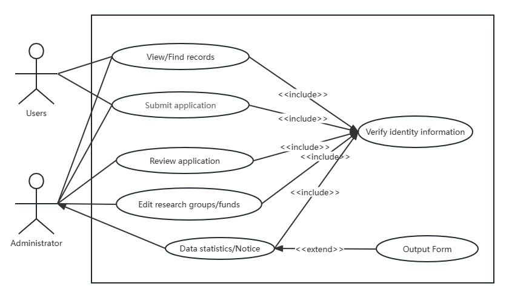
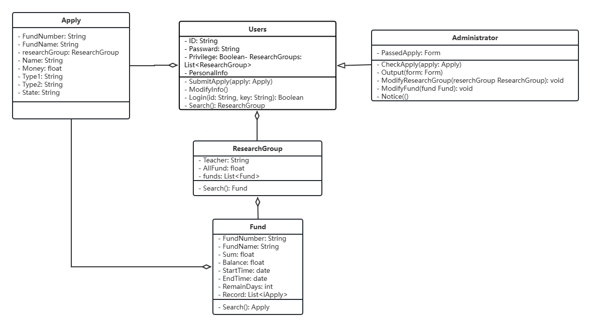
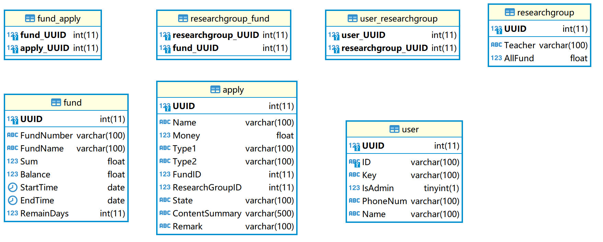
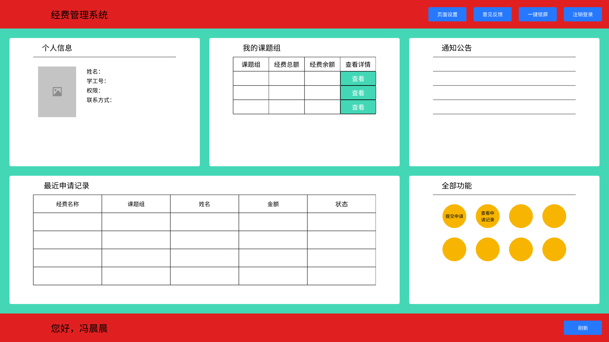
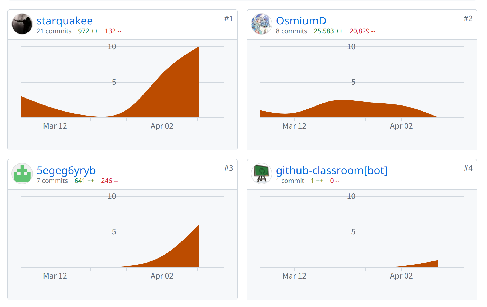
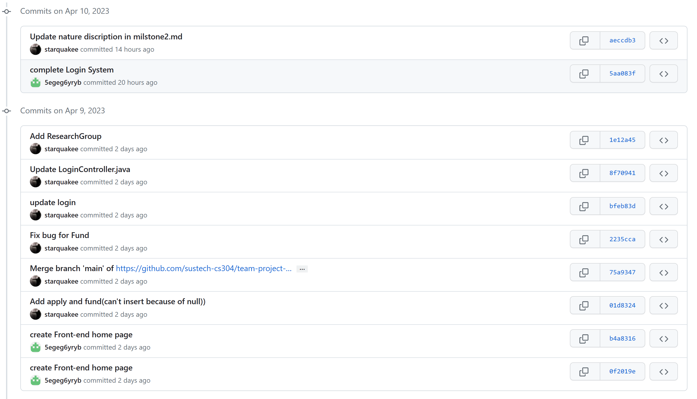
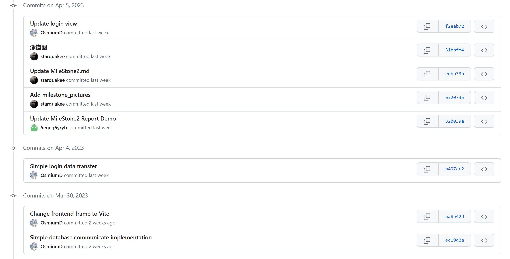
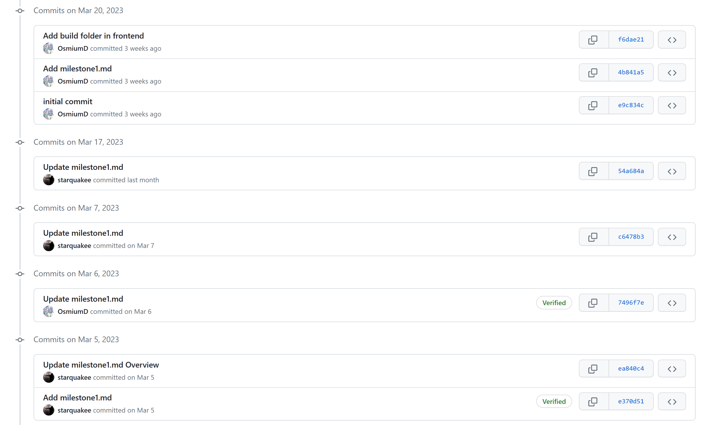
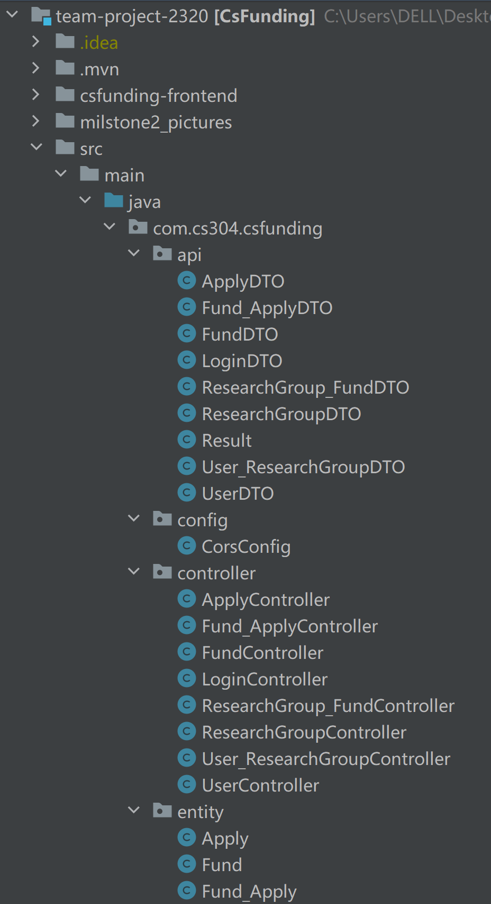
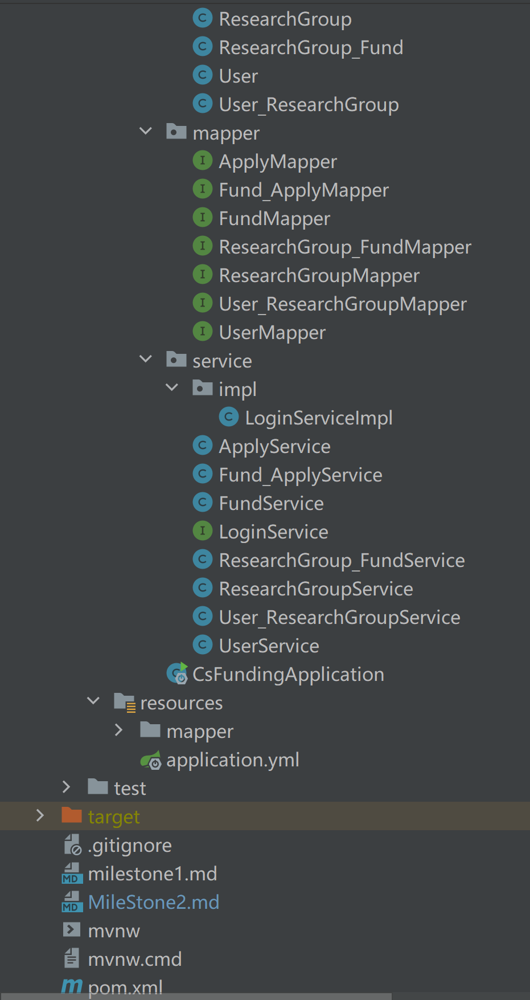

# MileStone2 Report

## 1. Requirements Modeling & Design

### 1.1 Use Case Diagram (2 points)

### 1.2 Swimlane Diagram (for one of the use cases) (1 point)

### 1.3 Natural Language Description (for one of the use cases) (1 point)
For example, for the login function, meta data is the account and password. We stored these two key pieces of data in the database. The password is only viewed from the database when logged in, and in ciphertext. Back-end will first judge whether the account and password are empty. If neither is empty, it will call the "findUserById" api to find the corresponding user in the database, and then compare the password entered by the user with the password stored in the database. If the password is equal, it will return the user, indicating that the user has logged in successfully.
### 1.4 Diagrams for Logical view (2 points)

### 1.5 Data Design (2 points)
First, we deal with user information, including the user's name, phone number, group affiliation, and so on. Next, we collect form relationships, including user ID, date of application, reimbursement amount, grant category, review status, summary of content, and remarks.

We then designed four tables to gather information about the class. In order to improve database performance, store old data and dirty data more conveniently, and prevent dependency transfer, we did not use foreign keys in the database, but added three tables representing one-to-many relationship. The four tables we designed are fund, apply, user, researchgroup. The fund table contains the fund number and the fund name, both of which are string, and then it stores Sum and Balance as float, preferably with the start and end times. The apply table contains string name, float money, two types, the funding ID, the research group ID, three review states, a summary of content up to 500 length, and comments up to 100 length. User class, including account password, phone number, user name. The research group category includes teachers and AllFund.

### 1.6 UI Design (2 points)

### 1.7 Collaborations (1 point)

Commit distribution:

### 1.8 Deliverables (1 point)
So far, we have built all the tables, and we have added and searched all the tables on the back end, but the table to table query is not complete. At present, the function part has login and user information query. The overall framework of the code section is complete, and you just need to refine it according to the functional requirements.

#### backend

#### frontend

## 4. Team Presentation & Demo (2 points)

