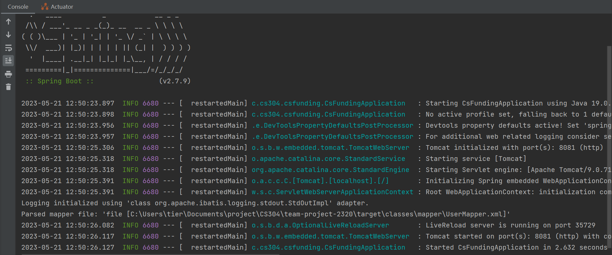
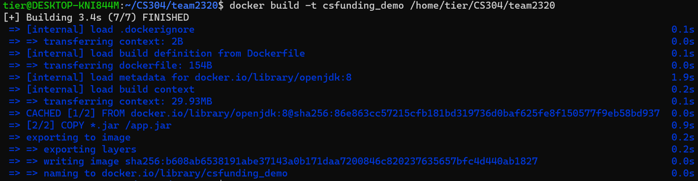
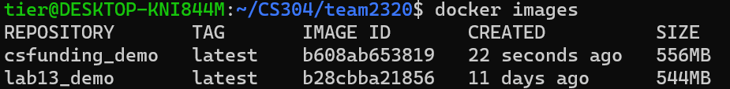
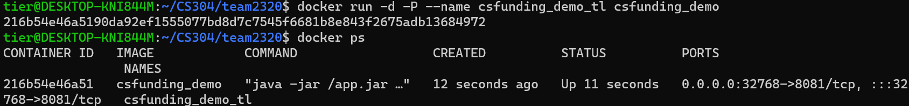

# Team Report

## Metrics

- Lines of Code Number of modules/subprojects

  
  L(J): Lines of Java

  

  LOC: Lines of code

- Number of packages

  

- Number of source files

  

- Number of 3rd party dependencies

  


We could also use metrics to estimate the maintainability of software systems. Please also answer:

- What is the maintainability of your team project?

  

  

  [team-project-2320/maintainability.pdf at main · sustech-cs304/team-project-2320 · GitHub](https://github.com/sustech-cs304/team-project-2320/blob/main/maintainability.pdf)
  
  this report is export by Code Climate

## Documentation for Users


login & sign up


sign up


main page for admin


main page for user


send apply


check apply


view funding(in group)


visualization


edit group

## Documentation for developers

### ApplyController

```java
@Data
public class ApplyDTO {
    private String name;
    private int money;
    private String type1;
    private String type2;
    private int fundID;
    private int researchGroupID;
    private int userID;
    private String state;
    private String contentSummary;
    private String remark;
    private int apply;
}
```

apply

```java
	@PostMapping(value = "/register/testapply")
    public String testAddApply(@RequestBody ApplyDTO applyDTO) {
        ...
    }
```

test to add an apply

```java
	@PostMapping(value = "/register/apply")
    public Result AddApply(@RequestBody ApplyDTO applyDTO) {
        ...
    }
```

add an apply

```java
	@PostMapping(value = "/register/resubmit")
    public Result ResubmitApply(@RequestBody ApplyDTO applyDTO) {
        ...
    }
```

resubmit an apply if it was rejected

```java
    @PostMapping(value = "/inspect-apply")
    public Result testJudgeApply(@RequestBody InspectDTO inspectDTO) {
        ...
    }
```

examine an apply

```java
    @RequestMapping(value = "/search-all-apply", method = {RequestMethod.GET, RequestMethod.POST})
    public Result searchAllApply(@RequestBody ApplySearchDTO searchDTO) {
        ...
    }
```

search apply by group, fund and state

```java
    @RequestMapping(value = "/search-apply-userid", method = {RequestMethod.GET, RequestMethod.POST})
    public Result searchApplyUserID(@RequestBody ApplySearchDTO searchDTO, @RequestParam int uid){
        ...
    }
```

get apply by user, group, fund and state

```java
    @GetMapping("/get-all-apply")
    public Result getAllApply() {
        ...
    }
```

get all apply

```java
    @GetMapping("/all-apply-fund")
    public Result getApplyByFundID(@RequestParam int fundID) {
        ...
    }
```

get apply by fund

```java
    @GetMapping("/selectapplybyresearchgroupid")
    public Result getApplyByResearchGroupID(int researchGroupID) {
        ...
    }
```

get apply by group

```java
    @GetMapping("/apply-userid")
    public Result getSortApplyByUserID(int userID) {
        ...
    }
```

get apply by user

```java
    @GetMapping("/my-apply")
    public Result getMyApply() {
        ...
    }
```

get current user's apply

```java
    @RequestMapping(value = "/search-my-apply", method = {RequestMethod.GET, RequestMethod.POST})
    public Result searchMyApply(@RequestBody ApplySearchDTO applySearchDTO){
        ...
    }
```

get current user's apply by group, fund and state

### Fund_ApplyController

```java
@Data
public class Fund_ApplyDTO {
    private int fundUUID;
    private int applyUUID;
}
```

fund_apply is to link fund and apply

```java
	@PostMapping(value = "/register/fund_apply")
    public Result testAddFundApply(@RequestBody Fund_ApplyDTO fund_applyDTO) {
        ...
    }
```

add a fund_apply

```java
    @GetMapping("/apply-by-fund")
    public Result getApplyByFund(@RequestParam int fid){
        ...
    }
```

get fund's apply

### FundController

```java
@Data
public class FundDTO {
    private String fundNumber;
    private String fundName;
    private float sum;
    private float balance;
    private int remainDays;
    private String startTime;
    private String endTime;
    private int uuid;
}
```

fund

```java
    @PostMapping(value = "/register/fund")
    public String testAddFund(@RequestBody FundDTO fundDTO) {
        ...
    }
```

add a fund

```java
    @PostMapping(value = "/modify/fund")
    public Result testModifyFund(@RequestBody FundDTO fundDTO) {
        ...
    }
```

modify a fund

```java
    @GetMapping("delete/fund")
    public Result testDeleteFund(@RequestParam int uuid) {
        ...
    }
```

delete a fund

```java
    @GetMapping("/getallfunds")
    public Result getAllFund(){
        ...
    }
```

get all fund

```java
    @GetMapping("/get-fund")
    public Result getFundByUuid(@RequestParam int uuid) {
        ...
    }
```

get fund by id

```java
    @GetMapping("/get-fund-vague")
    public Result getFundVague(@RequestParam String FundNumber,@RequestParam String FundName) {
        ...
    }
```

get fund vaguely by number and name

### LoginController

```java
@Data
public class LoginDTO {
    private String name;
    private String key;
}
```

login

```java
    @PostMapping(value = "/api/login")
    public Result login(@RequestBody LoginDTO loginDTO){
        ...
    }
```

try to login

### NoticeController

```java
@Data
public class NoticeDTO {
    private String content;
    private String time;
    private int uuid;
    private int noticeFrom;
    private int noticeTo;
}
```

notice

```java
    @PostMapping(value = "/register/notice")
    public String testAddNotice(@RequestBody NoticeDTO noticeDTO) {
        ...
    }
```

add a notice

```java
    @GetMapping("delete/notice")
    public Result testDeleteNotice(@RequestParam int uuid) {
        ...
    }
```

delete a notice

```java
    @GetMapping("/getallnotices")
    public Result testGetAllNotice(){
        ...
    }
```

get all notice

```java
@GetMapping("/get/notice")
    public Result testGetNoticeByID(@RequestParam int uuid){
        ...
    }
```

get notice by id

### ResearchGroup_FundController

```java
@Data
public class ResearchGroup_FundDTO {
    private int researchGroupUUID;
    private int fundUUID;
}
```

researchGroup_fund is to link fund and group

```java
    @PostMapping(value = "/register/research-group_fund")
    public Result testAddResearchGroupFund(@RequestBody ResearchGroup_FundDTO researchGroup_fundDTO) {
        ...
    }
```

add a researchGroup_fund

```java
    @GetMapping("/fund-research-group")
    public Result getFundByResearchGroup(int gid){
        ...
    }
```

get fund by group

### ResearchGroupController

```java
public class ResearchGroupDTO {
    private String teacher;
    private float allFund;
}
```

group

```java
    @PostMapping(value = "/register/researchgroup")
    public String testAddResearchGroup(@RequestBody ResearchGroupDTO researchGroupDTO) {
        ...
    }
```

add a group

```java
    @GetMapping("/get-all-research-groups")
    public Result getAllResearchGroup() {
        ...
    }
```

get all group

```java
    @GetMapping("/get-research-groups-by-name")
    public Result getResearchGroupByName(String teacherName) {
        ...
    }
```

get group by teacher's name

```java
    @GetMapping("/get-current-group")
    public Result getCurrentGroup() {
        ...
    }
```

get current user's group

```java
    @GetMapping("/get-research-groups-by-user")
    public Result getResearchGroupByUser(int UserID) {
        ...
    }
```

get group by user

```java
    @GetMapping("/current-group-data")
    public Result getCurrentResearchGroupData() {
        ...
    }
```

same as "/get-current-group"

```java
    @GetMapping("/user-group-fund-data")
    public Result getUserResearchGroupFundData(@RequestParam int uid) {
        ...
    }
```

get user's group's fund

```java
    @GetMapping("/current-group-fund-data")
    public Result getCurrentResearchGroupFundData() {
        ...
    }
```

get current user's group's fund

### User_ResearchGroupController

```java
public class User_ResearchGroupDTO {
    private int userUUID;
    private int researchGroupUUID;
}
```

user_researchGroup is to link user and group

```java
    @PostMapping(value = "/register/user_researchgroup")
    public Result testAddUserResearchGroup(@RequestBody User_ResearchGroupDTO user_researchGroupDTO) {
		...
    }
```

add a user_researchGroup

```java
    @GetMapping("/selectresearchgroupbyuser")
    public Result getResearchGroupByUser(@RequestParam int uid) {
        ...
    }
```

get user's group

```java
    @GetMapping("/current-group-id")
    public Result getCurrentGroup() {
        ...
    }
```

get current user's group

### UserController

```java
@Data
public class UserDTO {
    private String key;
    private String phoneNum;
    private String name;
}
```

user

```java
    @PostMapping(value = "/register/user")
    public String testAddUser(@RequestBody UserDTO userDTO) {
        ...
    }
```

add a user

```java
    @GetMapping("/all-users")
    public Result getAllUser() {
        ...
    }
```

get all user

```java
    @GetMapping("/getalladmins")
    public List<User> getAllAdmin(){
        ...
    }
```

get all admin

```java
    @GetMapping("/user-id")
    public Result getUserByID(@RequestParam String id) {
        ...
    }
```

get user by id

```java
    @GetMapping("/current-user")
    public Result getCurrentUser() {
        ...
    }
```

get current user

```java
    @GetMapping("/user-phone")
    public Result getUserByPhoneNum(String id) {
        ...
    }
```

get user by phone number

## Build
### Framework: SpringBoot
SpringBoot provides Java developers with a platform to get started with an auto configurable production-grade Spring application. With it, developers can get started quickly without losing time on preparing and configuring their Spring application.

### Technology/Tools
+ Mysql: MySQL is a relational database management system. Databases are the essential data repository for all software applications.
+ Lombok: Lombok is a library that helps reduce boilerplate code in Java applications. It provides annotations that generate code during compilation time.

### Plugins
+ SpringBoot Maven Plugin: It provides a connection between Spring project and Maven. The connection helps the developer test and package the project with high efficiency.
+ Jacoco Maven Plugin: The Jacoco Maven Plugin is used to generate code coverage reports for unit tests. It provides a way to measure how much of the code is covered by unit tests. The plugin generates a report that shows the percentage of code that is covered by unit tests.

### Tasks during building
+ Configure the project
+ Set the filter for web content and interaction
+ Embed the project on the web server with Tomcat
+ Set up the context for project
+ Start service

### Buildfile for project build
Our project uses pom.xml for the whole building process. The artifacts are involved in below picture.


## Deployment

### Technology/Tools: Docker
Docker is an open-source engine that automates the deployment of applications into containers. It is an open platform for developing, shipping, and running applications. Docker enables us to separate our applications from our infrastructure so us can deliver software quickly. With Docker, we can manage our infrastructure in the same ways we manage our applications.

### Preparation for containerization
Picture below is the dockerfile we used for image creation

The process and result for image build



### Containerization
Run the image in container

The proof for the success of containerization:

The first try is failed by the wrong instruction. The second try is an approximate success because 415 means the CsFunding System is running properly. The third try is a success because we login into the system successfully and get a token from container.